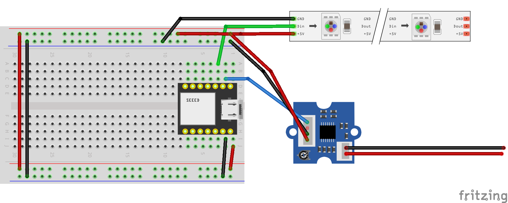

# Workshop 1: How to Prototype (Almost) Any Circuit

## Part 3: Get Ready for the Workshop

This workshop is designed to help you build practical skills in circuit prototyping, combining hardware integration, software development, and networking technologies.

---

## Your Kit

### Components Included

#### **Xiao ESP32-S3**
- **Processor**: Dual-core Xtensa LX7 processor
- **Memory**: Built-in RAM and Flash storage
- **Connectivity**: Wi-Fi and Bluetooth support
- **GPIO**: Multiple general-purpose input/output pins
- **Interfaces**: I2C, SPI, UART support

#### **Grove GSR Sensor**
- **Functionality**: Galvanic Skin Response sensor for measuring skin conductance
- **Interface**: Grove connector for easy plug-and-play
- **Compatibility**: Works seamlessly with Xiao ESP32-S3

#### **WS2812 LED Strip**
- **Type**: Addressable RGB LED strip
- **Control**: Individual LED control via data pin
- **Power**: 5V power supply
- **Interface**: Single-wire communication protocol

#### **Prototyping Materials**
- Breadboard
- Jumper wires
- USB cables
- Additional connectors and components

---

## Workshop Activities

### Warm-up Exercise (15 minutes)

**Building a Simple Sensor-Actuator System**

Learn the fundamentals by creating a basic feedback system.

#### Wiring Diagram

#### Wiring Instructions
1. **GSR Sensor Connection**: Connect to Grove port A0 on the Xiao ESP32-S3
2. **LED Strip Connection**: Connect the LED strip data pin to GPIO D2
3. **Power**: Ensure proper 5V power supply to the LED strip
   - Connect GND (ground) from breadboard to ESP32-S3 GND
   - Connect +5V power rail to LED strip power input
   - Connect Din (data in) from LED strip to ESP32-S3 GPIO D2

**Objective**: Create a system where the GSR sensor reading controls the LED strip colors or patterns.

---

### Hard Mode Challenge (45 minutes)

⚠️ **DANGER ZONE** ⚠️

**This is a system combining practically everything we just covered.**

#### Project Components

##### 1. **Prototyping Fundamentals**
- Apply Ohm's Law (V = I × R) for power calculations
- Implement proper power management
- Use breadboard prototyping techniques
- Debug circuits using systematic approaches

##### 2. **Hardware Integration**
- Integrate multiple sensors and actuators
- Implement proper wiring protocols
- Manage GPIO pin assignments
- Handle power distribution correctly

##### 3. **Networking Technologies**
- Utilize Wi-Fi connectivity on ESP32-S3
- Implement wireless communication protocols
- Set up device-to-device communication
- Explore ESP-NOW or Wi-Fi Direct options

##### 4. **Software Development**
- Program the ESP32-S3 using Arduino IDE or PlatformIO
- Implement sensor reading algorithms
- Control addressable LEDs with libraries (e.g., FastLED, Adafruit NeoPixel)
- Create responsive feedback systems

##### 5. **Complete System**
- Build an end-to-end IoT system
- Integrate biometric sensing with visual feedback
- Implement real-time data processing
- Create a responsive, interactive installation

#### System Architecture
The complete system should demonstrate:
- **Input Layer**: Biometric data acquisition (GSR sensor)
- **Processing Layer**: ESP32-S3 microcontroller running custom firmware
- **Output Layer**: Visual feedback via addressable LED strip
- **Network Layer**: Optional wireless communication for data logging or remote control

Refer to `hard_diagram.png` for the complete system architecture.

---

## Resources

### Directories
- **1_Hardware_Starter**: Basic hardware setup and examples
- **2_Hard_Mode**: Advanced challenge materials and reference code
- **p5_server**: Web-based visualization server (optional)

### Files
- `Workshop_Wiring_bb.png`: Breadboard wiring diagram for warm-up exercise
- `Workshop_Wiring.fzz`: Fritzing source file for wiring diagram

---

## Getting Started

1. **Set up your development environment**
   - Install Arduino IDE or PlatformIO
   - Install ESP32 board support
   - Install required libraries (FastLED, Grove sensors, etc.)

2. **Test your hardware**
   - Verify Xiao ESP32-S3 connection
   - Test GSR sensor readings
   - Test LED strip control

3. **Start with the warm-up**
   - Follow the wiring diagram
   - Upload basic example code
   - Verify sensor-to-actuator response

4. **Challenge yourself with Hard Mode**
   - Design your complete system
   - Implement advanced features
   - Integrate networking capabilities

---

## Learning Objectives

By the end of this workshop, you will be able to:
- ✅ Wire sensors and actuators to a microcontroller
- ✅ Read analog sensor data and process it
- ✅ Control addressable LED strips
- ✅ Apply basic circuit design principles
- ✅ Debug hardware and software issues
- ✅ Build complete interactive systems
- ✅ Integrate wireless communication (Hard Mode)

---

## Support

For questions or troubleshooting:
- Check the reference materials in each directory
- Review the wiring diagrams carefully
- Consult the course slides and documentation
- Ask instructors for assistance

---

**Let's prototype (almost) any circuit!** 🚀
